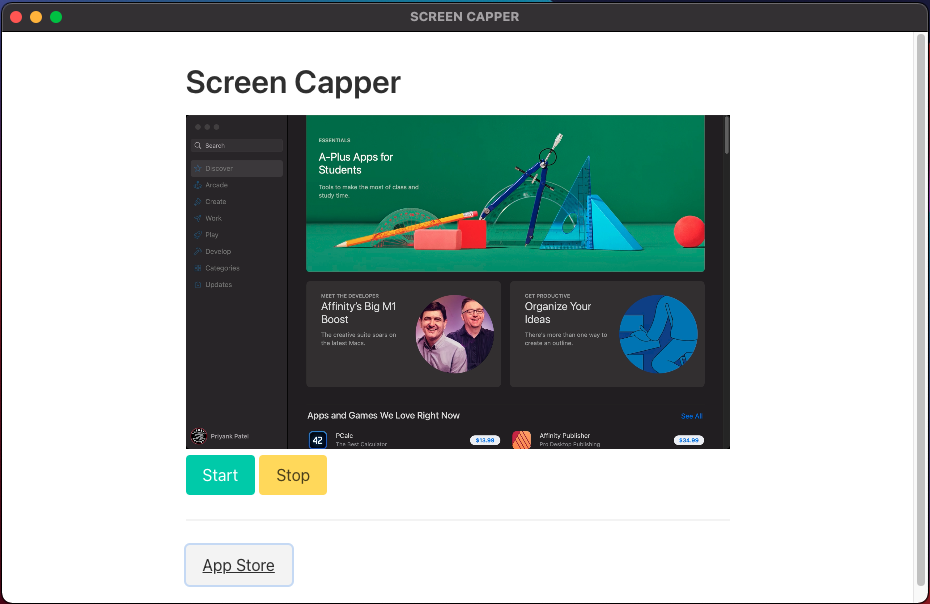

# ScreenCapper
An cross-platform app to clip screen recordings and save them to a local directory.

To run locally:
- CD into ScreenCapper
- ```npm run make```
- Check the 'out' directory for the executable


